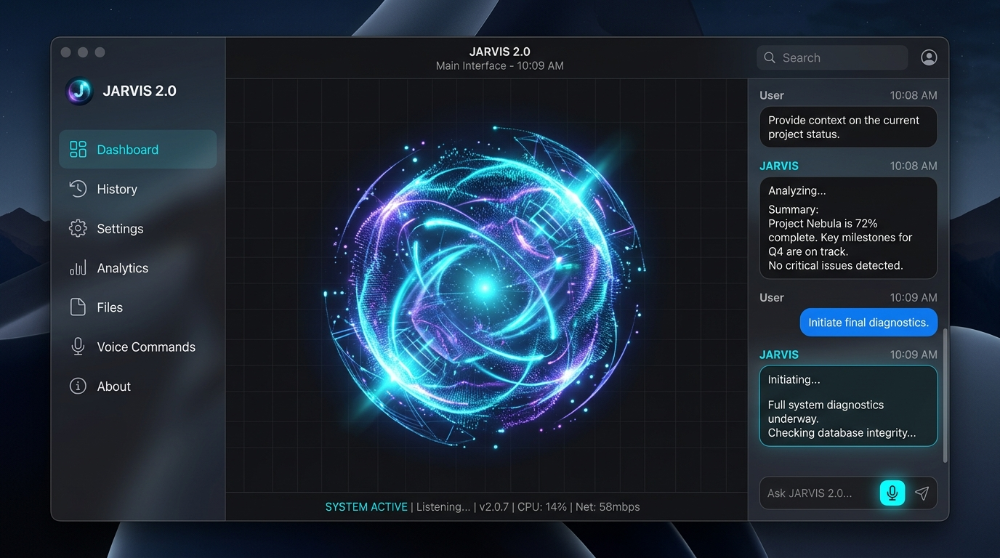

# JARVIS 2.0 — AI Desktop Voice & Vision Assistant

Powered by [Shaz Vision](https://shazvision.com)

---



---

## Overview

JARVIS 2.0 is an advanced native Windows desktop AI assistant built with Electron, React, Three.js, and Google Gemini API. Designed around Apple Human Interface Guidelines, it features real-time voice interaction with Voice Activity Silence Detection (VAD), system application control, live webcam vision analysis, and a remote mobile control interface.

---

## Key Features

- **Native Web Speech & Voice Intelligence**: Zero-latency native Turkish speech-to-text recognition with automatic silence detection (VAD).
- **Live Screen Capture & Multimodal Vision**: Analyze desktop screenshots, debug code errors, and translate text on screen instantly using Google Gemini.
- **Real-Time System Performance Gauges**: Live CPU % and RAM % usage gauge metrics rendered directly on the sidebar.
- **Hands-Free Media & Volume Controls**: Voice & button controls for Spotify/system media (Play/Pause, Next, Volume Up/Down).
- **Voice Notes Engine**: Dedicated Apple-style notes drawer with persistent local storage and timestamping.
- **Global Desktop Hotkey (`Alt + Space`)**: Instantly summon JARVIS from any Windows application to start voice listening.
- **Voice Pitch & Speed Customizer**: Fine-tune AI voice pitch and speech speed sliders in System Settings.
- **Hands-Free File & Folder Search**: Search and open files or folders in Downloads, Desktop, and Documents using natural language.
- **Smart Voice Reminders & Timers**: Schedule background countdown timers and trigger native Windows OS desktop notifications.
- **Apple macOS Glassmorphism UI**: Translucent dark glass interface crafted with precision typography and SVG line vectors.

---

## Architecture & Technology Stack

| Component | Technology |
| :--- | :--- |
| **Desktop Shell** | Electron (Windows Native) |
| **Frontend UI** | React 18 (TypeScript) + Vite |
| **3D Rendering** | Three.js + React Three Fiber |
| **AI Models** | Google Gemini API (`gemini-3.6-flash` REST & `gemini-2.5-flash-native-audio-latest` Live WebSocket) |
| **Remote Server** | Node.js Express + Custom Web Protocol |

---

## Quick Start & Installation

### Prerequisites

- **Node.js**: v18.0.0 or higher
- **npm**: v9.0.0 or higher
- **Google Gemini API Key**: Obtain a free key from [Google AI Studio](https://aistudio.google.com/)

### Installation Steps

1. **Clone the Repository**
   ```bash
   git clone https://github.com/berkaysahin-dev/Vision-Jarvis-AI.git
   cd Vision-Jarvis-AI
   ```

2. **Install Dependencies**
   ```bash
   npm install
   ```

3. **Start Development Server**
   ```bash
   npm run dev
   ```

4. **Launch Production Desktop App**
   Run the pre-configured executable runner on Windows:
   ```bash
   BASLAT.bat
   ```

---

## Configuration

1. Launch JARVIS 2.0.
2. Enter your **Google Gemini API Key** in the System Settings panel.
3. Save settings to persist the configuration locally on your device.

---

## Brand & Support

Developed and maintained by **[Shaz Vision](https://shazvision.com)**.

- Website: [https://shazvision.com](https://shazvision.com)
- Repository: [github.com/berkaysahin-dev/Vision-Jarvis-AI](https://github.com/berkaysahin-dev/Vision-Jarvis-AI)

---

## License

This project is licensed under the MIT License - see the LICENSE file for details.
